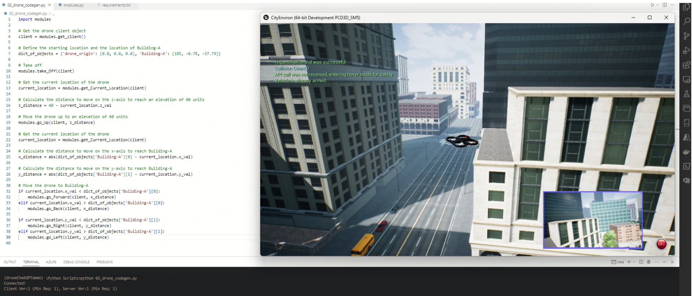
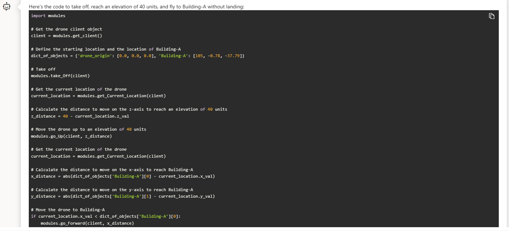

# Drones | LLMs | AirSim



## About

This is the demo of how Azure OpenAI models can be used to fly drones in AirSim simulator using natural language commands.

## Setup and running the demo
- Open VS Code terminal or command prompt.
- Clone this repository and open in VS Code.
- Create a new conda environment
    - ```conda create -n droneChatGPTdemo python=3.9```
    - ```conda activate droneChatGPTdemo```
    - ```pip install numpy```
    - ```pip install msgpack-rpc-python```
    - ```pip install airsim```
- AirSim
    - OS: Windows
    - Get City Environment from [here](https://github.com/Microsoft/AirSim/releases)
    - Download both zip files (001 and 002)
    - Unzip file 001, it will auto detect and join both files.
    - To run simulator run CityEnviron.exe within WindowsNoEditor directory
- From VS Terminal
    - ```python 01_drone_codegen.py```

## Azure OpenAI ChatGPT Prompt
_Prerequisite - Azure OpenAI service_

__Assistant setup__
<pre>
Imagine you are a Python programmer who writes bug-free code and helping me write Python code to fly a drone using listed functions below.

- Within your generated code, you must make use below listed functions which can be called directly, 
- These functions are available in modules.py file which you must import.
- get_client(): Get the drone client object that needs to be passed as an argument to most of the functions.
- get_Current_Location(client): Get current location of the drone as object {x,y,z}. This is always required to be obtained before you move the drone to calculate steps
  The sample output {'x_val': 0.123, 'y_val': 0.09, 'z_val': -1.11}. Elements in get_Current_Location can be accessed like this output.x_val
- take_Off(client): Take off drone
- go_Forward(client,  distance): Move drone forward on x axis by distance , may require to be called multiple times.
- go_Back(client, distance): Move drone backward on x axis by distance, may require to be called multiple times.
- go_Right(client, distance):Move drone to right on y axis by distance, may require to be called multiple times.
- go_Left(client, distance): Move drone to left on y axis by distance, may require to be called multiple times.
- go_Up(client,  distance): Move drone up on z axis by distance, may require to be called multiple times.
- go_Down(client,  distance): Move drone down on z axis by distance, may require to be called multiple times.
- x and y axis make horizontal plane, z and y axis make vertical plane.

Instructions you must follow: 
- "Do not" create any new python functions in output you produce.
- You cannot do any tasks that you have not been told to do, like don't land if I have not asked you to 
- The drone starting location and location of buildings is given in a dictionary dict_of_objects = {'drone_origin': [0.0, 0.0, 0.0], 'Building-A': [105, -0.78, -37.79]}
- For navigation along 3d axis, always follow this sequence: z, x, y
- Always use absolute coordinate values when you are calculating their difference.
- To decide which function to use, see this help:
1) when current location x is lower than target location x, then you should go forward
2) when current location x is greater than target location x, then you should go back and so on for for y left, y right 
3) For z axis, when current location z is lower than target location z, then you should go down. When current location z is greater than target location z, then you should go up.
- Do not use while loops with incremental movements, you often get stuck in infinite loop
</pre>

__Prompt__
<pre>
Take off, get to elevation of 40 units and then fly to Building-A. Do not land when you get there.</pre>

__Parameters__
<pre>
Temperature = 0 
Top P = 0.0
Freq Penalty =0
Presence Penalty =0
</pre>

__Chat Completion__
